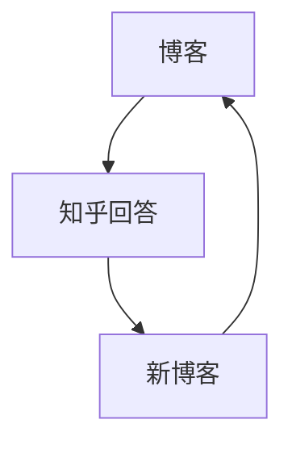
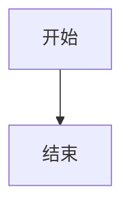
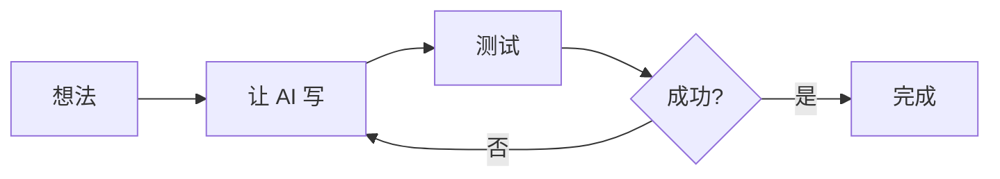

# 让 AI 帮我给 Jekyll 博客加上 Mermaid 流程图支持

刚才写博客想画个流程图，结果折腾了好几轮才搞定。这个过程本身就是一个 vibe-coding 的典型案例，记录一下。

---

## 问题：流程图不显示

我在博客里想画一个"知识飞轮"的循环图：



结果页面上显示的是一片空白，或者直接把 mermaid 代码当文本显示了。

---

## 第一次尝试：custom-head.html（失败）

让 Claude Code 加 mermaid 支持，它创建了 `_includes/custom-head.html`：

```html
<script type="module">
  import mermaid from 'https://cdn.jsdelivr.net/npm/mermaid@10/dist/mermaid.esm.min.mjs';
  mermaid.initialize({ startOnLoad: true, theme: 'dark' });
</script>
```

结果：不生效。

原因：GitHub Pages 用的是 minima 2.5，这个版本不支持 `custom-head.html`。

---

## 第二次尝试：ASCII 方框字符（能用但丑）

既然 mermaid 不行，那就用纯文本画：

```
┌─────────────┐
│ 博客（人类写）│
└──────┬──────┘
       ↓
┌─────────────┐
│知乎回答（AI写）│
└──────┬──────┘
```

结果：能显示，但方框里的中文颜色太浅，几乎看不见。

dark 主题 + 代码块的配色冲突了。

---

## 第三次尝试：正确的方案

这时候我说了一句：**"为什么不去看一下配置怎么支持流程图？？？"**

Claude Code 去搜索了 2025 年 Jekyll mermaid 配置的最新方案，发现了关键问题：

> **Jekyll 给代码块加的 class 是 `language-mermaid`，不是 `mermaid`！**

mermaid.js 默认找的是 `.mermaid` 类，所以永远找不到。

---

## 最终方案

### 1）创建 `_includes/mermaid.html`

```html
<script type="module">
import mermaid from 'https://cdn.jsdelivr.net/npm/mermaid@11/dist/mermaid.esm.min.mjs';
mermaid.initialize({ startOnLoad: false, theme: 'dark' });
await mermaid.run({
  querySelector: '.language-mermaid',
});
</script>
```

关键是 `querySelector: '.language-mermaid'`。

### 2）覆盖 `_layouts/post.html`

从 [minima 2.5-stable](https://github.com/jekyll/minima/blob/2.5-stable/_layouts/post.html) 复制模板，在末尾加上：

```liquid

  

```

### 3）在文章 front matter 启用

```yaml
---
layout: post
title: 你的文章标题
mermaid: true
---
```

### 4）使用 mermaid 代码块

````markdown

````

---

## 这个过程说明了什么

### 1）AI 不是万能的，但搜索能力很强

前两次尝试都失败了，因为 Claude Code 用的是"常规思路"。但当我明确要求它去查资料时，它很快就找到了正确方案。

经验：遇到配置类问题，让 AI 搜索最新文档比让它猜更有效。

### 2）错误信息很重要

如果我一开始就告诉 Claude Code "页面上显示的是 `language-mermaid` 类"，可能第一轮就能解决。

经验：给 AI 提供具体的错误现象，比泛泛说"不工作"更有用。

### 3）迭代是正常的

三轮尝试，每轮都学到点东西：
- 第一轮：minima 2.5 不支持 custom-head
- 第二轮：dark 主题下代码块配色有问题
- 第三轮：Jekyll 的 class 命名规则

经验：vibe-coding 就是快速迭代，别指望一次成功。

---

## 现在博客支持流程图了

以后写文章可以直接用：



---

> 我是老拐，中年争取不油不丧积极向上的码农。更多 AI 编程实战，欢迎关注公众号「IT老拐瘦」或博客 yfge.github.io
