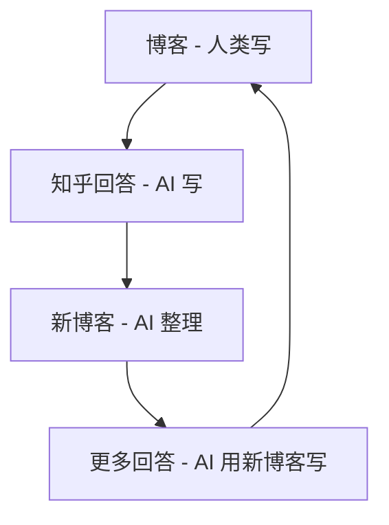
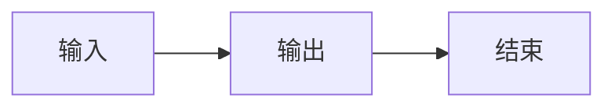
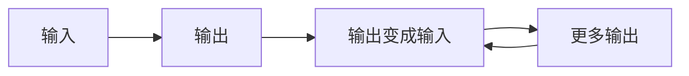

# AI 驱动的知识飞轮：让 Claude Code 自己造轮子、自己跑

今天发生了一件有意思的事：我让 Claude Code 根据我的博客回答知乎问题，然后把回答整理成新博客，然后这篇博客又可以用来回答更多问题。

这是一个闭环。更有意思的是，**整个闭环是 AI 在驱动**。

---

## 飞轮是怎么转起来的

### 第一圈：博客 → 知乎回答

我写了一系列 vibe-coding 九阳神功的博客：

- 夯：Git 基础操作
- 抄：用优秀项目搭底盘
- 学：技术栈组合

然后做了个 Claude Code Skill（[ZhiForge](https://github.com/yfge/zhiforge)），让 AI 自动：

1. 读取知乎邀请
2. 匹配博客内容
3. 撰写回答
4. 自动发布

一个命令 `/auto-zhihu`，全自动。

### 第二圈：知乎回答 → 新博客

今天回答了几个问题后，我发现这些回答本身也有价值：

- 《Claude Code 开发工作流》—— 综合了几篇回答
- 《码农提升自己最快的方式》—— 针对热门问题的专题

于是让 Claude Code 把这些回答整理成博客文章。

### 第三圈：新博客 → 更多回答

这些新博客又进入了知识库，下次遇到类似问题，AI 就能用这些内容来回答。

**飞轮转起来了。**

---

## 为什么这件事有意思

### 1）AI 在"自我投喂"

传统的 AI 应用是：人类提供数据 → AI 学习 → AI 输出。

现在变成了：



AI 的输出变成了 AI 的输入。当然，人类还在环路里——我需要审核、修改、决定发不发。但"内容生产"这件事，AI 已经能自己循环了。

### 2）知识在"滚雪球"

每回答一个问题，我的知识库就增加一点。

- 原来只有博客文章
- 现在有了知乎回答版本（更口语化、更针对性）
- 还有了综合整理版本（更系统化）

同一个知识点，有了不同的"形态"，能适配不同的场景。

### 3）Claude Code 在"自己造轮子"

ZhiForge 这个 Skill 本身就是 Claude Code 写的。

也就是说：

- Claude Code 写了一个工具（ZhiForge）
- 这个工具让 Claude Code 能自动回答问题
- 回答的内容又能喂给 Claude Code 写更多东西

**AI 在给自己造工具，然后用工具给自己造内容。**

---

## 人类在这个循环里干什么

你可能会问：那人类还有什么用？

有用。人类的角色是：

1. **启动飞轮** —— 最初的博客是人写的
2. **质检** —— AI 写的东西需要审核
3. **方向盘** —— 决定回答哪些问题、不回答哪些
4. **刹车** —— 发现错误及时停下来

AI 是发动机，人类是司机。

---

## 技术实现

如果你想复刻这个飞轮，需要：

**1）知识库**

一个 Markdown 文件夹，放你的博客、笔记、文档。

**2）ZhiForge Skill**

```bash
/install-github-skill yfge/zhiforge
```

配置好知识库路径和作者信息。

**3）Chrome MCP**

让 Claude Code 能操作浏览器。

**4）一个命令**

```
/auto-zhihu
```

然后看着它自己跑。

---

## 这件事的意义

我觉得这件事最有意思的地方不是"效率提升"，而是：

**AI 开始有了"自我循环"的能力。**

以前 AI 是一次性的：



现在 AI 可以：



这不是 AGI，但这是一个信号：AI 正在从"工具"变成"系统"。

工具是你用一次就放下的。系统是自己会跑的。

---

## 最后

今天这篇博客本身也会进入知识库。

下次有人问"AI 怎么自动化内容生产"，Claude Code 就会用这篇文章来回答。

然后那个回答可能又会变成一篇新博客。

飞轮继续转。

---

> 我是老拐，中年争取不油不丧积极向上的码农。更多 AI 编程实战，欢迎关注公众号「IT老拐瘦」或博客 yfge.github.io
